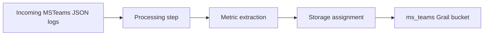

import { Steps, Aside } from '@astrojs/starlight/components';

Use this guide to prepare Dynatrace so it can receive and process collector data.

## 1. Create a Logs Bucket

Create a dedicated Grail bucket for MS Teams data.

Recommended settings:

| Setting | Value |
|---|---|
| Name | `ms_teams` |
| Display name | `Microsoft Teams Observability` |
| Table type | `logs` |
| Retention | `90` days (adjust to policy) |

## 2. Create an OpenPipeline Logs Pipeline

Configure these steps:

- **Processing step**
  Why: parse and normalize fields used by dashboards and queries.
  What: parse `startDateTime` and key call metadata fields.
  Example: convert timestamp text into queryable datetime.
- **Metric extraction step**
  Why: expose reusable quality metrics from logs.
  What: extract `ms.teams.callDurationS` and `ms.teams.streamDurationS`.
  Example: build percentile widgets from extracted values.
- **Storage assignment step**
  Why: guarantee Teams records are stored in the expected bucket.
  What: route processed Teams records to `ms_teams`.
  Example: assign all `MSTeams_*` records to one storage target.

<Aside type="note">
If your platform team enforces naming standards, use those standards for pipeline and route names.
</Aside>

## 3. Create a Dynamic Route

Create a routing rule that sends records matching `MSTeams_*` source patterns to your Teams pipeline.

## 4. Allow Required Outbound Hosts

In Dynatrace **Settings -> Preferences -> Outbound connections**, allow:

- `graph.microsoft.com`
- `login.microsoftonline.com`
- `ip-api.com` (only if geolocation enrichment is enabled)

## 5. Add Microsoft Credentials to Credential Vault

Create a credential entry for the Microsoft app registration used by the Dynatrace app.

| Field | Value |
|---|---|
| Scope | `AppEngine` |
| App access | `Microsoft Teams Observability` |
| Value | `client_id/client_secret` or certificate with passphrase |

<Steps>
1. Go to **Settings -> Credential Vault**.
2. Create a credential.
3. Set scope to `AppEngine` and grant access to the MS Teams Observability app.
4. Enter the credential value.
5. Save and note the credential ID.
</Steps>

## 6. Complete App Configuration

<Steps>
1. Open **Apps -> Microsoft Teams Observability**.
2. Open **Installation and Configuration**.
3. Set tenant ID and credential vault reference.
4. Save configuration.
5. Verify live data appears in dashboards.
</Steps>

If data is missing, continue with <a href={`${import.meta.env.BASE_URL}backends/dynatrace/collector-connection/`}>Collector Connection</a> and <a href={`${import.meta.env.BASE_URL}backends/dynatrace/troubleshooting/`}>Dynatrace Troubleshooting</a>.
