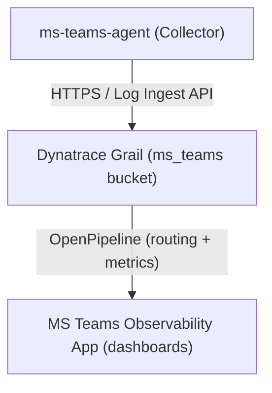

import { LinkCard, CardGrid, Aside } from '@astrojs/starlight/components';

The Dynatrace integration is the most complete backend for MS Teams Observability. It covers:

- **Storage**: Grail bucket for Teams log data.
- **Processing**: OpenPipeline for metric extraction, routing, and enrichment.
- **Application**: A dedicated app with operational dashboards for call quality, site performance, user activity, and Microsoft incident correlation.

## Architecture

## Deployment Path

<CardGrid>
  <LinkCard
    title="1) Prerequisites"
    description="Dynatrace permissions, Grail access, and Hub access required before setup."
    href={`${import.meta.env.BASE_URL}backends/dynatrace/prerequisites/`}
  />
  <LinkCard
    title="2) Install the App"
    description="Install the MS Teams Observability app from Dynatrace Hub or via ZIP upload."
    href={`${import.meta.env.BASE_URL}backends/dynatrace/app/installation/`}
  />
  <LinkCard
    title="3) Configure Dynatrace"
    description="Create the Grail bucket, OpenPipeline, routing rules, and Credential Vault entry."
    href={`${import.meta.env.BASE_URL}backends/dynatrace/configuration/`}
  />
  <LinkCard
    title="4) Connect the Collector"
    description="Configure the collector output section to point to your Dynatrace tenant."
    href={`${import.meta.env.BASE_URL}backends/dynatrace/collector-connection/`}
  />
  <LinkCard
    title="5) Use the Dashboards"
    description="Navigate the operational dashboards for call quality, users, sites, and incident correlation."
    href={`${import.meta.env.BASE_URL}backends/dynatrace/dashboards/`}
  />
  <LinkCard
    title="6) Dynatrace Extension (Beta)"
    description="Run the collector as a Dynatrace Extension on your ActiveGate instead of a standalone binary."
    href={`${import.meta.env.BASE_URL}backends/dynatrace/extension/`}
  />
  <LinkCard
    title="7) Use the Application"
    description="User guide for the MS Teams Observability app — Home, Calls, Sites, Users, Issues, and Configuration."
    href={`${import.meta.env.BASE_URL}backends/dynatrace/app/`}
  />
</CardGrid>

<Aside type="tip">
If something is not working after setup, see <a href={`${import.meta.env.BASE_URL}backends/dynatrace/troubleshooting/`}>Troubleshooting</a> or the <a href={`${import.meta.env.BASE_URL}reference/faq/`}>FAQ</a>.
</Aside>
