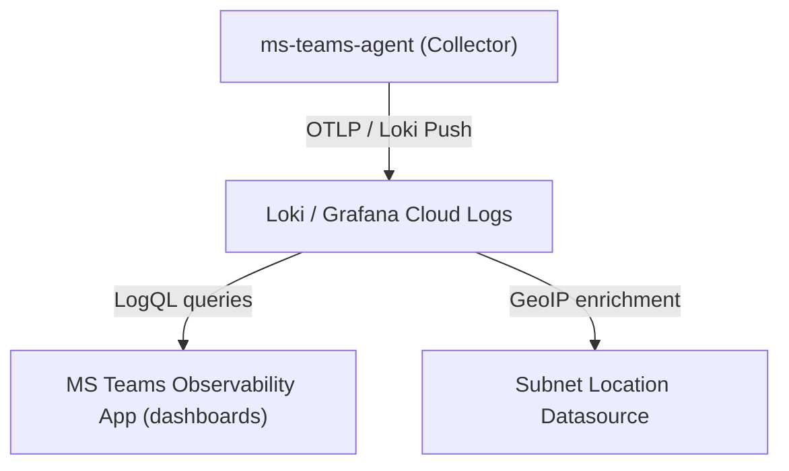

import { LinkCard, CardGrid, Aside } from '@astrojs/starlight/components';

The Grafana integration provides a native Grafana plugin application for MS Teams Observability, published on the Grafana Plugin Catalog. It covers:

- **Plugin App**: A dedicated application with operational dashboards for call quality, user activity, site performance, and Microsoft incident correlation.
- **Datasources**: Loki-based datasource for Teams telemetry, plus an optional Subnet Location datasource for GeoIP enrichment.
- **Bundled Dashboards**: Ready-to-use dashboards for call analysis and user activity.

## Architecture

## Deployment Path

<CardGrid>
  <LinkCard
    title="1) Prerequisites"
    description="Grafana ≥ 12.3.0, a Loki datasource, and a collector sending MS Teams logs."
    href={`${import.meta.env.BASE_URL}getting-started/prerequisites/`}
  />
  <LinkCard
    title="2) Install the Plugin"
    description="Install the MS Teams Observability plugin from the Grafana Plugin Catalog or via ZIP upload."
    href={`${import.meta.env.BASE_URL}backends/grafana/app/installation/`}
  />
  <LinkCard
    title="3) Configure Datasources"
    description="Set up the MS Teams Observability datasource (Loki) and optional Subnet Location datasource."
    href={`${import.meta.env.BASE_URL}backends/grafana/app/provisioning/`}
  />
  <LinkCard
    title="4) Connect the Collector"
    description="Configure the collector OTLP output to send logs to your Loki instance or Grafana Cloud."
    href={`${import.meta.env.BASE_URL}backends/otlp/grafana/`}
  />
  <LinkCard
    title="5) Use the Application"
    description="User guide for the MS Teams Observability app — Home, Calls, Sites, Users, Issues, and Configuration."
    href={`${import.meta.env.BASE_URL}backends/grafana/app/`}
  />
  <LinkCard
    title="6) Use the Dashboards"
    description="Explore the bundled dashboards for calls and users analysis."
    href={`${import.meta.env.BASE_URL}backends/grafana/dashboards/`}
  />
</CardGrid>

<Aside type="tip">
The Grafana app uses the same collector and log data as Dynatrace and Splunk. You can run multiple backends simultaneously — just add the Grafana OTLP output alongside your existing config.
</Aside>
