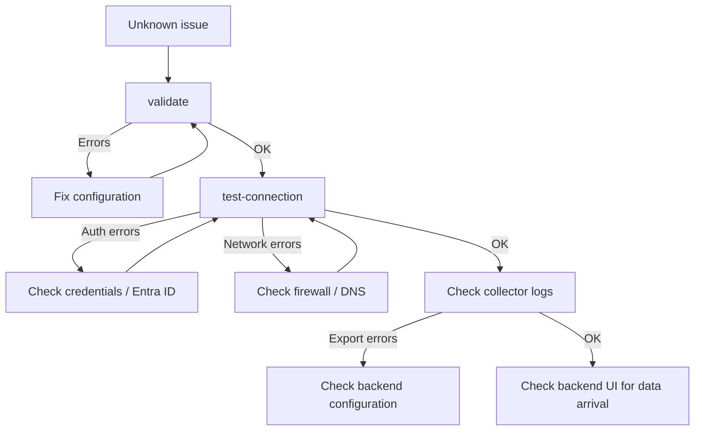

import { Aside } from '@astrojs/starlight/components';

## Authentication Issues

- Verify tenant ID, client ID, and secret/certificate in your config.
- Confirm admin consent is granted for required Microsoft Graph permissions.
- Check system time drift on the collector host.

### Error: `AADSTS500011` (resource principal not found)

This error indicates the tenant does not recognize the application/resource principal used by the collector.

Typical message:

```text
Authentication failed: AADSTS500011: The resource principal named [Application ID] was not found in the tenant named [Tenant Name].
```

**Checks:**
1. Confirm tenant ID points to the correct tenant.
2. Confirm client ID matches the app registration expected in that tenant.
3. Verify the application is registered/available in this tenant and not in a different directory.
4. Re-run **admin consent** for required Graph application permissions.
5. If multi-tenant/service principal deployment is used, ensure the service principal exists in the target tenant.

### Error: `401 InvalidAuthenticationToken`

This error indicates the access token is invalid, expired, or generated with incorrect credentials.

Typical message:

```text
APIError Code: 401, Message: InvalidAuthenticationToken
```

**Checks:**
1. Regenerate/rotate the client secret (or validate certificate/key pair) and update config.
2. Ensure credentials are valid for the same tenant.
3. Confirm collector host time is synchronized (clock drift can invalidate tokens).
4. Re-run validation and test-connection checks.

### Error: `401 InvalidAuthenticationToken / InvalidCloudInstance`

This indicates a cloud instance mismatch (for example token/authority for one cloud, Graph endpoint for another).

Typical message:

```text
APIError Code: 401, Message: InvalidAuthenticationToken / InvalidCloudInstance
```

**Checks:**
1. Verify `cloud_deployment` matches your tenant cloud instance.
2. If `scope` is explicitly set, ensure it matches the same cloud instance.
3. Re-test after updating configuration.

<Aside type="note">
These authentication failures apply to all deployment variants (v1, v2, and extension) and commonly block collection of user/report and service health data, not only call records.
</Aside>

## Connectivity Issues

- Validate outbound access to:
  - `graph.microsoft.com`
  - `login.microsoftonline.com`
  - `reportsncu.office.com` (Microsoft Graph report download redirect)
  - your backend endpoint
- Confirm proxy/firewall rules for HTTPS traffic.

## TLS Certificate Errors

If the collector logs show a `TLS certificate verification failed` error mentioning `reportsncu.office.com`, this is **not a licensing problem**. That domain is a Microsoft redirect used for Graph API report downloads.

**Cause:** The collector host's CA trust store does not include the certificate authority of the server or TLS-inspecting proxy.

**Fix options (choose one):**

1. Update the OS CA trust store on the collector host:
   - Linux: `sudo update-ca-certificates`
   - Windows: import the CA certificate into the system certificate store

2. Set `advanced.ca_bundle_path` in `config.yaml` pointing to your enterprise CA bundle in PEM format — see [Advanced Options](./configuration/#4-advanced-options).

## Data Not Visible in Backend

- Confirm at least one output is enabled in configuration.
- Review collector logs for export errors.
- Validate backend-side credentials (Dynatrace token or Splunk HEC token).

## Next Steps

**Symptom:** Collector runs without errors but no data appears in the backend.

**Checks:**
1. Confirm the output backend is `enabled: true` in the config.
2. Run `test-connection` to verify backend connectivity.
3. Check collector logs for export errors.
4. Confirm the collection interval has elapsed (wait at least one full `interval_collection_minutes` cycle).
5. If using `--dry-run`, note that dry-run mode does not export data.

## Service / systemd Issues

**Symptom:** The collector service fails to start or stops unexpectedly.

**Checks:**
1. Check service logs: `journalctl -u ms-teams-observability-agent@default.service -f`
2. Verify the config file path in the service unit is an absolute path.
3. Confirm the service user has read access to the config and license files.
4. Re-run with `sudo`: `sudo ms-teams-agent service enable-service --config /absolute/path/config.yaml`

See [Service Management](/collector/v2/service/) for setup and management details.

## Stale or Corrupted State

**Symptom:** Collector behaves unexpectedly after a restart or data seems duplicated/skipped.

**Checks:**
1. Inspect the current state:
   ```bash
   ms-teams-agent state show
   ```
2. If state appears corrupted, reset it (use with care in production):
   ```bash
   ms-teams-agent state reset
   ```

<Aside type="caution">
State reset causes the collector to re-process data from the beginning of the collection window. This may result in duplicate data in your backend for the affected period.
</Aside>

## Diagnostic Workflow



When troubleshooting an unknown issue, follow this order:

1. `validate` — check configuration
2. `test-connection` — check authentication and backend connectivity
3. Collector logs — check for runtime errors
4. Backend logs / UI — confirm data arrival

<Aside type="tip">
For backend-specific issues (Dynatrace or Splunk), see the corresponding troubleshooting guides: [Dynatrace Troubleshooting](/backends/dynatrace/troubleshooting/) / [Splunk Troubleshooting](/backends/splunk/troubleshooting/).
</Aside>
