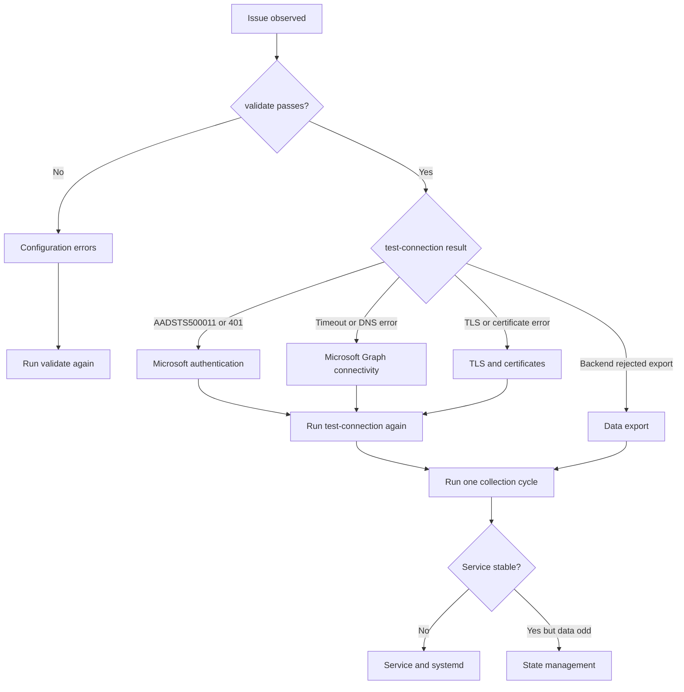
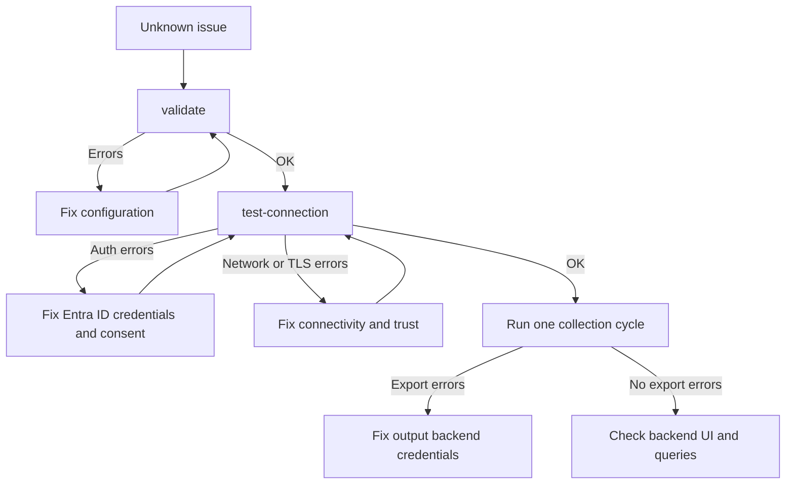

import { Aside } from '@astrojs/starlight/components';

## Decision Tree



Use this order first: `validate` -> `test-connection` -> one real run -> backend-specific troubleshooting.

## 1. Configuration Errors

### `validate` returns schema or YAML errors

**Symptom**
`ms-teams-agent validate --config ./config.yaml` exits with one or more errors.

**Root cause**
Required sections are missing, YAML indentation is invalid, or enabled outputs are misconfigured.

**Fix**
1. Ensure all required sections exist: `microsoft_authentication`, `license`, `output`, `collection_config`.
2. Check YAML indentation and key names.
3. Confirm `license.filepath` points to a readable file.
4. Confirm at least one output backend is `enabled: true`.
5. Re-run validation after each correction.

**Verification command**
```bash
ms-teams-agent validate --config ./config.yaml
```

## 2. Microsoft Authentication

### Error `AADSTS500011` (resource principal not found)

**Symptom**
`test-connection` fails and logs include `AADSTS500011`.

**Root cause**
The tenant cannot find the expected app registration or service principal.

**Fix**
1. Confirm `tenant_id` points to the intended tenant.
2. Confirm `client_id` matches the app registration in that tenant.
3. Re-check app registration visibility in Microsoft Entra ID.
4. Re-grant admin consent for required Graph application permissions.
5. In multi-tenant deployments, confirm a service principal exists in the target tenant.

**Verification command**
```bash
ms-teams-agent test-connection --config ./config.yaml
```

### Error `401 InvalidAuthenticationToken`

**Symptom**
Collector logs show `APIError Code: 401, Message: InvalidAuthenticationToken`.

**Root cause**
The token is expired, invalid, or generated with inconsistent credentials.

**Fix**
1. Rotate the client secret or re-check the certificate/key pair.
2. Confirm credentials belong to the same tenant as `tenant_id`.
3. Confirm `grant_type: "client_credentials"`.
4. Sync host time to avoid token validation failures.
5. Re-run validation and connection tests.

**Verification command**
```bash
ms-teams-agent validate --config ./config.yaml
ms-teams-agent test-connection --config ./config.yaml
```

### Error `401 InvalidCloudInstance`

**Symptom**
Logs show `InvalidAuthenticationToken / InvalidCloudInstance`.

**Root cause**
`cloud_deployment` and token scope target different Microsoft cloud instances.

**Fix**
1. Set `microsoft_authentication.graph.cloud_deployment` to the correct value.
2. If `scope` is set manually, align it with the same cloud instance.
3. Keep authority and Graph endpoints in the same cloud family.
4. Re-test with debug logs enabled.

**Verification command**
```bash
ms-teams-agent test-connection --config ./config.yaml
ms-teams-agent run --config ./config.yaml --log-level DEBUG --dry-run
```

### Token errors after certificate or secret rotation

**Symptom**
Authentication fails immediately after credential updates.

**Root cause**
Old credentials are still used by the running process or the new value is malformed.

**Fix**
1. Check whether the service loads the expected `config.yaml` path.
2. Validate PEM format for certificate authentication.
3. Remove trailing spaces in secret values.
4. Restart the service after changes.

**Verification command**
```bash
ms-teams-agent service status --config /absolute/path/config.yaml
ms-teams-agent test-connection --config /absolute/path/config.yaml
```

<Aside type="note">
Authentication failures usually block call records, reports, and service health collection at the same time.
</Aside>

## 3. Microsoft Graph Connectivity

### Timeouts, DNS errors, or proxy failures

**Symptom**
`test-connection` fails with timeout, connection reset, or DNS resolution errors.

**Root cause**
The collector host cannot reach required Microsoft endpoints.

**Fix**
1. Confirm outbound HTTPS access to `graph.microsoft.com` and `login.microsoftonline.com`.
2. Confirm access to `reportsncu.office.com` for report download redirects.
3. Validate DNS resolution from the collector host.
4. Check proxy configuration for the collector runtime user.
5. Re-test from the same host context as the collector service.

**Verification command**
```bash
nslookup graph.microsoft.com
curl -I https://graph.microsoft.com
ms-teams-agent test-connection --config ./config.yaml
```

## 4. TLS / Certificates

### TLS verification failed (`reportsncu.office.com` or backend endpoint)

**Symptom**
Logs show `TLS certificate verification failed`.

**Root cause**
The OS trust store does not contain the issuing CA, often due to enterprise TLS inspection.

**Fix**
1. Update the host CA trust store.
2. If required, configure `advanced.ca_bundle_path` with your PEM CA bundle.
3. Ensure endpoint hostname matches the certificate SAN.
4. Re-test with `test-connection`.

**Verification command**
```bash
ms-teams-agent test-connection --config ./config.yaml
```

## 5. Data Export

### Collector runs but no data appears in backend

**Symptom**
The collector process is healthy, but dashboards and searches remain empty.

**Root cause**
Output is disabled, export credentials are invalid, or cycle timing has not elapsed.

**Fix**
1. Confirm at least one output backend is enabled.
2. Run `test-connection` to validate backend reachability, credentials, and OTLP headers (for example Grafana Cloud or Datadog).
3. Run one cycle without previous state to observe fresh export.
4. Wait at least one `interval_collection_minutes` cycle.
5. If using `--dry-run`, remove it for live export.

**Verification command**
```bash
ms-teams-agent test-connection --config ./config.yaml
ms-teams-agent run --config ./config.yaml --ignore-state
```

<Aside type="tip">
If collector-side checks are green and backend data is still missing, continue with backend troubleshooting: <a href={`${import.meta.env.BASE_URL}backends/dynatrace/troubleshooting/`}>Dynatrace</a> or <a href={`${import.meta.env.BASE_URL}backends/splunk/troubleshooting/`}>Splunk</a>.
</Aside>

## 6. Service / systemd

### Service fails to start or restarts repeatedly

**Symptom**
systemd reports failed state or restart loops.

**Root cause**
The service uses an invalid config path, missing file permissions, or invalid runtime environment.

**Fix**
1. Check service logs with `journalctl`.
2. Ensure `--config` path is absolute in the service unit.
3. Confirm service user can read config and license files.
4. Re-enable service with a validated config path.

**Verification command**
```bash
journalctl -u ms-teams-observability-agent@default.service -f
sudo ms-teams-agent service enable-service --config /absolute/path/config.yaml
```

## 7. State Management

### Duplicate or skipped records after restart

**Symptom**
Data appears duplicated or expected records are not exported after restart.

**Root cause**
State cache is stale or inconsistent with the expected collection window.

**Fix**
1. Inspect current state.
2. Reset state only when reprocessing is acceptable.
3. Run one controlled cycle and verify export behavior.
4. Return to normal service mode once validated.

**Verification command**
```bash
ms-teams-agent state show
ms-teams-agent state reset
ms-teams-agent run --config ./config.yaml --ignore-state
```

<Aside type="caution">
State reset causes reprocessing inside the collection window and may create temporary duplicates in the backend.
</Aside>

## 8. Diagnostic Workflow



Recommended sequence:

1. `ms-teams-agent validate --config ./config.yaml`
2. `ms-teams-agent test-connection --config ./config.yaml`
3. `ms-teams-agent run --config ./config.yaml --ignore-state`
4. Backend-specific troubleshooting when collector checks are green
