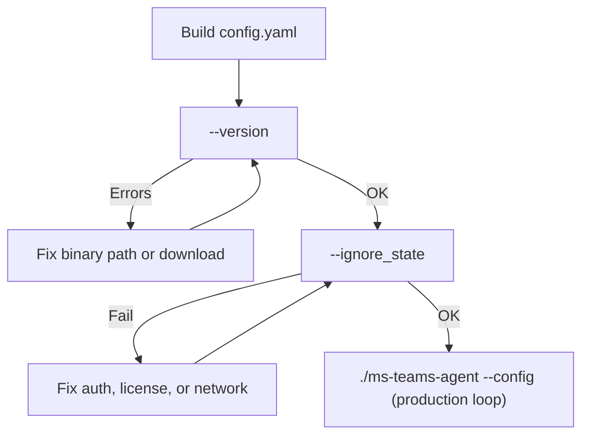

import { Steps, Aside, Tabs, TabItem } from '@astrojs/starlight/components';

## Before You Start

1. Configure Microsoft Graph permissions (see <a href={`${import.meta.env.BASE_URL}collector/azure-permissions/`}>Azure Permissions</a>).
2. Download the collector binary (`ms-teams-agent.bin` or `ms-teams-agent.exe`) and template config (`conf/template_config.yaml`) from the <a href="https://github.com/Phenisys/microsoft-teams-observability/releases/latest" target="_blank" rel="noopener noreferrer">latest GitHub release</a>.
3. Obtain your license file and note its absolute path for `collection_config.license_file`.

Collector source repository: <a href="https://github.com/Phenisys/microsoft-teams-observability" target="_blank" rel="noopener noreferrer">microsoft-teams-observability</a>

## Prerequisites

- Host with outbound access to:
  - `graph.microsoft.com`
  - `login.microsoftonline.com`
  - your backend endpoint (Dynatrace or Splunk)
- Microsoft tenant and app registration credentials
- Valid license file (`collection_config.license_file`)

<Aside type="note">
The collector uses a single binary command style (global flags), not sub-commands.
</Aside>

## Build Your Config

Start from the template and set at least:

```yaml
microsoft_authentication:
  microsoft_tenant_id: "<tenant_id>"
  microsoft_client_id: "<client_id>"
  microsoft_client_secret: "<client_secret>"
  microsoft_scope: "https://graph.microsoft.com/.default"
  microsoft_grant_type: "client_credentials"

output:
  dynatrace:
    enabled: true
    dynatrace_tenant_id: "<tenant_id>"
    dynatrace_api_token: "<token>"
  splunk:
    enabled: false
  console:
    enabled: false

collection_config:
  logging_services: ["dynatrace"]
  microsoft_max_call_duration_hours: 5
  interval_collection_minutes: 1
  logfile_log_level: "INFO"
  license_file: "/absolute/path/license.lic"
  features:
    ms_teams_calls_collection:
      enabled: true
```

Full settings reference: <a href={`${import.meta.env.BASE_URL}collector/v1/configuration/`}>Configuration</a>

<Aside type="tip">
Enable one output first (Dynatrace or Splunk), confirm ingestion, then add additional outputs.
</Aside>

## Validate and Test

<Steps>
1. Confirm the binary is available:

   <Tabs>
     <TabItem label="Linux">
   ```bash
   ./ms-teams-agent.bin --version
   ```
     </TabItem>
     <TabItem label="Windows">
   ```powershell
   .\ms-teams-agent.exe --version
   ```
     </TabItem>
   </Tabs>

2. Run one first collection cycle without previous state:

   <Tabs>
     <TabItem label="Linux">
   ```bash
   ./ms-teams-agent.bin --config ./conf/config.yaml --ignore_state
   ```
     </TabItem>
     <TabItem label="Windows">
   ```powershell
   .\ms-teams-agent.exe --config .\conf\config.yaml --ignore_state
   ```
     </TabItem>
   </Tabs>

3. (Optional) debug a specific call:

   <Tabs>
     <TabItem label="Linux">
   ```bash
   ./ms-teams-agent.bin --config ./conf/config.yaml --call_id "<CALL_ID>"
   ```
     </TabItem>
     <TabItem label="Windows">
   ```powershell
   .\ms-teams-agent.exe --config .\conf\config.yaml --call_id "<CALL_ID>"
   ```
     </TabItem>
   </Tabs>
</Steps>



## Start the Collector (Production)

<Tabs>
  <TabItem label="Linux">
```bash
./ms-teams-agent.bin --config ./conf/config.yaml
```
  </TabItem>
  <TabItem label="Windows">
```powershell
.\ms-teams-agent.exe --config .\conf\config.yaml
```
  </TabItem>
</Tabs>

## Service Automation (Linux)

For persistent production execution:

```bash
sudo ./ms-teams-agent.bin --config /absolute/path/config.yaml --enable_boot_start
```

See <a href={`${import.meta.env.BASE_URL}collector/v1/service/`}>Service Management</a> for service lifecycle operations.

## Verify Ingestion

- Agent log file:
  - `logs/pheniAgent_<tenant_id>.log`
- Collector state file:
  - `state/state_<tenant_id>.json`

Follow logs:

<Tabs>
  <TabItem label="Linux">
```bash
tail -f logs/pheniAgent_<tenant_id>.log
```
  </TabItem>
  <TabItem label="Windows">
```powershell
Get-Content .\logs\pheniAgent_<tenant_id>.log -Wait
```
  </TabItem>
</Tabs>

Then confirm events in your backend:
- Dynatrace: check logs and app dashboards
- Splunk: check events in the target index

<Aside type="tip">
If no data appears after one interval, use <a href={`${import.meta.env.BASE_URL}collector/troubleshooting/`}>Collector Troubleshooting</a>.
</Aside>
