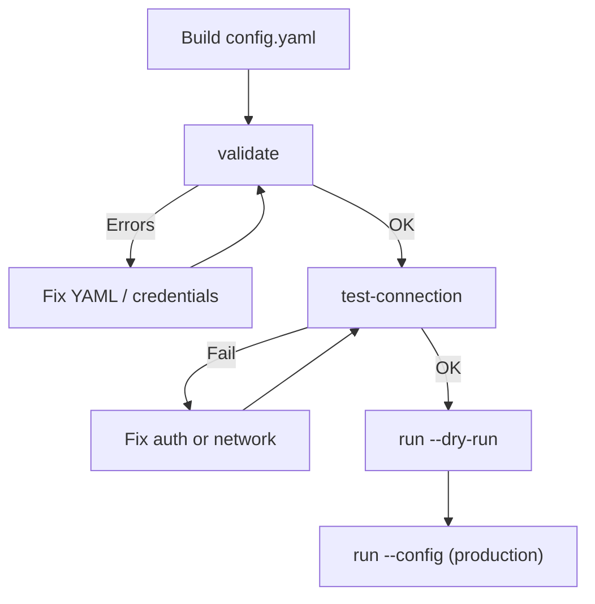

import { Steps, Aside, Tabs, TabItem } from '@astrojs/starlight/components';

## Checklist Before You Start

- [ ] Microsoft 365 tenant with Teams calling activity
- [ ] Microsoft Entra app registration with Graph permissions (see [Azure Permissions](../../azure-permissions/))
- [ ] Admin consent granted for `CallRecords.Read.All`, `Reports.Read.All`, `ServiceHealth.Read.All`
- [ ] Collector host with outbound access to `graph.microsoft.com`, `login.microsoftonline.com`, and your backend endpoint
- [ ] Valid license file (see [License](../../../getting-started/license/))
- [ ] Download collector binary from the latest release

## Build Your Config

Start from template and set at least:

```yaml
microsoft_authentication:
  graph:
    tenant_id: "<tenant-id>"
    client_id: "<client-id>"
    client_secret: "<secret>" # or client_certificate_path

license:
  filepath: /etc/ms-teams-observability-agent/license.json

output:
  dynatrace:
    enabled: true
    dynatrace_tenant_id: "<env>"
    dynatrace_api_token: "dt0c01..."

collection_config:
  interval_collection_minutes: 10
  max_call_duration_hours: 5
  features:
    calls_collection:
      enabled: true
```

Full settings reference: [Configuration Reference](../configuration/)

## Validate and Test

<Steps>
1. Validate file structure and business rules:

   ```bash
   ms-teams-agent validate --config ./config.yaml
   ```

2. Test Graph auth and exporters:

   ```bash
   ms-teams-agent test-connection --config ./config.yaml
   ```

3. Run one dry cycle:

   ```bash
   ms-teams-agent run --config ./config.yaml --dry-run
   ```
</Steps>

✅ Success criteria:
- `validate` returns no error
- `test-connection` confirms Graph authentication and backend connectivity
- `dry-run` completes one full cycle without errors

❌ If this fails:
- <a href={`${import.meta.env.BASE_URL}collector/troubleshooting/`}>Collector Troubleshooting</a>



## Start the Collector

<Tabs>
  <TabItem label="Linux/macOS">
```bash
ms-teams-agent run --config ./config.yaml
```
  </TabItem>
  <TabItem label="Windows">
```powershell
.\ms-teams-agent.exe run --config .\config.yaml
```
  </TabItem>
</Tabs>

## Service Automation (Linux)

For persistent production execution, install as a systemd service:

```bash
sudo ms-teams-agent service enable-service --config /absolute/path/config.yaml
sudo ms-teams-agent service status
```

See [Service (Linux)](../service/) for Linux service operation.

## Verify Ingestion

- Agent logs:

```bash
tail -f logs/agent.log
```

- State snapshot:

```bash
ms-teams-agent state show
```

- Backend verification:
  - Dynatrace: check app overview for real tenant data
  - Splunk: check `ms_teams` index receives events

<Aside type="tip">
If data still does not appear after one interval, follow [Runbook Troubleshooting](../runbook/#common-errors-and-fixes).
</Aside>

✅ Success criteria:
- Collector logs show successful collection cycles
- `ms-teams-agent state show` reports valid state
- Backend receives at least one `MSTeams_*` record

❌ If this fails:
- <a href={`${import.meta.env.BASE_URL}collector/troubleshooting/`}>Collector Troubleshooting</a>
- Verify backend configuration and network connectivity
