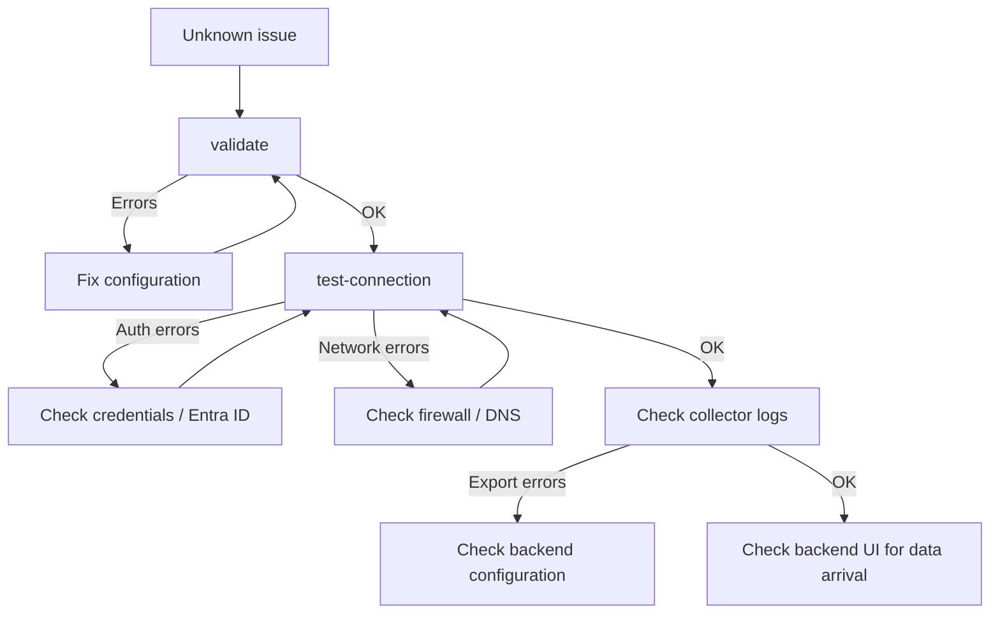

import { Aside } from '@astrojs/starlight/components';

## Configuration Errors

**Symptom:** `ms-teams-agent validate` exits with errors.

**Checks:**
1. Ensure all required sections are present: `microsoft_authentication`, `license`, `output`, `collection_config`.
2. Verify YAML formatting — indentation errors are a common cause of validation failures.
3. Confirm the license file path exists and is readable by the collector process.
4. Confirm at least one output backend is `enabled: true`.

Run:
```bash
ms-teams-agent validate --config ./config.yaml
```

## Microsoft Authentication Errors

**Symptom:** `test-connection` fails with authentication errors, or collector logs show `401` / `403` from Microsoft Graph.

**Checks:**
1. Verify `tenant_id` and `client_id` are correct (no extra spaces or characters).
2. For client secret: confirm the secret has not expired in Azure.
3. For certificate: confirm the PEM file contains both private and public key, and the passphrase (if any) is correct.
4. Confirm admin consent has been granted for all required Graph permissions (`CallRecords.Read.All`, `Reports.Read.All`, `ServiceHealth.Read.All`).
5. Confirm the app registration is not disabled in Microsoft Entra ID.

### Error: `AADSTS500011` (resource principal not found)

This error indicates the tenant does not recognize the application/resource principal used by the collector.

Typical message:

```text
Authentication failed: AADSTS500011: The resource principal named [Application ID] was not found in the tenant named [Tenant Name].
```

**Checks:**
1. Confirm `microsoft_authentication.graph.tenant_id` points to the correct tenant.
2. Confirm `client_id` matches the app registration expected in that tenant.
3. Verify the application is registered/available in this tenant and not in a different directory.
4. Re-run **admin consent** for required Graph application permissions.
5. If this is multi-tenant/app-to-app, ensure the service principal exists in the target tenant.

### Error: `401 InvalidAuthenticationToken`

This error indicates the access token is invalid, expired, or generated with incorrect credentials.

Typical message:

```text
APIError Code: 401, Message: InvalidAuthenticationToken
```

**Checks:**
1. Regenerate/rotate the client secret (or validate certificate/key pair) and update config.
2. Ensure `grant_type: "client_credentials"` and credentials are valid for the same tenant.
3. Confirm collector host time is synchronized (clock drift can invalidate tokens).
4. Run `ms-teams-agent validate --config ./config.yaml` then `test-connection`.

### Error: `401 InvalidAuthenticationToken / InvalidCloudInstance`

This indicates a cloud instance mismatch (for example token/authority for one cloud, Graph endpoint for another).

Typical message:

```text
APIError Code: 401, Message: InvalidAuthenticationToken / InvalidCloudInstance
```

**Checks:**
1. Verify `microsoft_authentication.graph.cloud_deployment` matches your tenant cloud:
   - `global`
   - `us_gov_gcc_high`
   - `us_gov_dod`
   - `china`
2. If `scope` is explicitly set, ensure it matches the same cloud instance as `cloud_deployment`.
3. Re-test with `test-connection` and debug logs after updating config.

<Aside type="note">
These authentication failures commonly block collection of user activity/report and service health data, not only call records.
</Aside>

Run with debug logging for more detail:
```bash
ms-teams-agent run --config ./config.yaml --log-level DEBUG
```

## Microsoft Graph Connectivity Issues

**Symptom:** `test-connection` fails with network errors or timeouts.

**Checks:**
1. Confirm outbound access to `graph.microsoft.com` and `login.microsoftonline.com` from the collector host.
2. Check firewall and proxy rules.
3. Validate DNS resolution for `graph.microsoft.com`.
4. If using a proxy, ensure it is configured correctly in the collector environment.

## No Data Being Exported

**Symptom:** Collector runs without errors but no data appears in the backend.

**Checks:**
1. Confirm the output backend is `enabled: true` in the config.
2. Run `test-connection` to verify backend connectivity.
3. Check collector logs for export errors.
4. Confirm the collection interval has elapsed (wait at least one full `interval_collection_minutes` cycle).
5. If using `--dry-run`, note that dry-run mode does not export data.

## Service / systemd Issues

**Symptom:** The collector service fails to start or stops unexpectedly.

**Checks:**
1. Check service logs: `journalctl -u ms-teams-observability-agent@default.service -f`
2. Verify the config file path in the service unit is an absolute path.
3. Confirm the service user has read access to the config and license files.
4. Re-run with `sudo`: `sudo ms-teams-agent service enable-service --config /absolute/path/config.yaml`

See [Service Management](/collector/v2/service/) for setup and management details.

## Stale or Corrupted State

**Symptom:** Collector behaves unexpectedly after a restart or data seems duplicated/skipped.

**Checks:**
1. Inspect the current state:
   ```bash
   ms-teams-agent state show
   ```
2. If state appears corrupted, reset it (use with care in production):
   ```bash
   ms-teams-agent state reset
   ```

<Aside type="caution">
State reset causes the collector to re-process data from the beginning of the collection window. This may result in duplicate data in your backend for the affected period.
</Aside>

## Diagnostic Workflow



When troubleshooting an unknown issue, follow this order:

1. `validate` — check configuration
2. `test-connection` — check authentication and backend connectivity
3. Collector logs — check for runtime errors
4. Backend logs / UI — confirm data arrival

<Aside type="tip">
For backend-specific issues (Dynatrace or Splunk), see the corresponding troubleshooting guides: [Dynatrace Troubleshooting](/backends/dynatrace/troubleshooting/) / [Splunk Troubleshooting](/backends/splunk/troubleshooting/).
</Aside>
