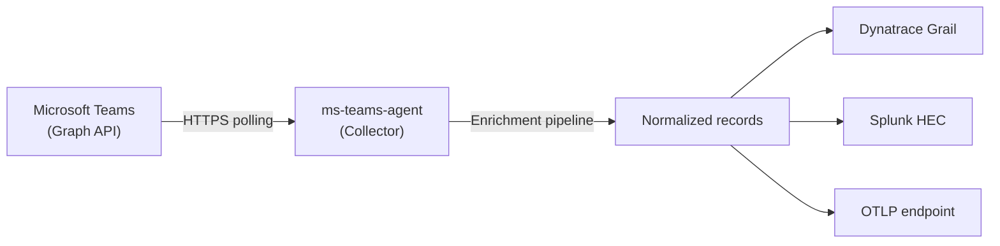
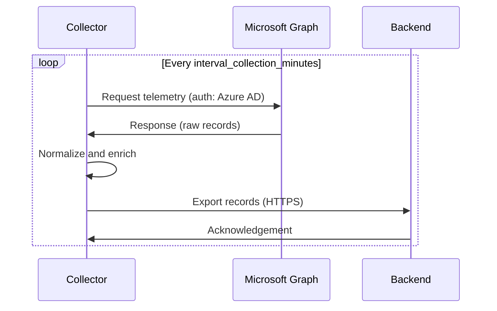
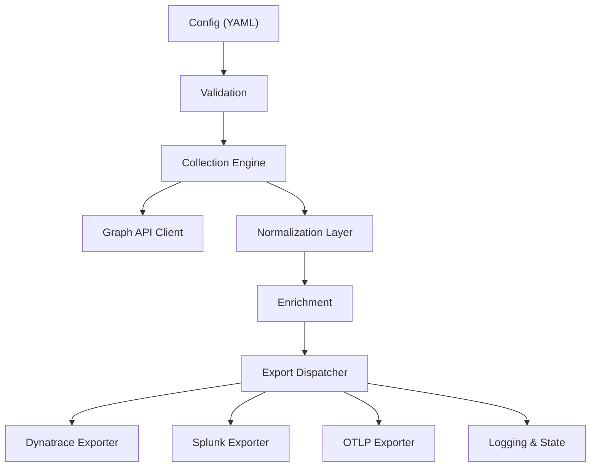
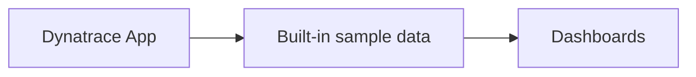
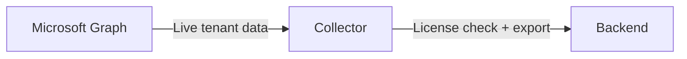

import { Aside } from '@astrojs/starlight/components';

MS Teams Observability collects telemetry from Microsoft Graph, enriches it in the collector, and exports it to one or more backends.

## High-Level Flow

1. **Collection** — the collector authenticates to Microsoft Graph using your Azure app registration and polls Teams telemetry (call records, service announcements, auto attendant and call queue data).
2. **Normalization** — raw Graph responses are transformed into consistent event families with uniform field names and types.
3. **Enrichment** — records are enriched with geolocation (if enabled), site mapping from `sites.csv`, and derived quality indicators.
4. **Export** — enriched records are sent to each enabled output backend in parallel.
5. **Storage & visualization** — each backend stores the data and renders it through the provided app or dashboards.

## Collection Cycle

## Collector Internal Architecture

## Data Flow by Mode

### Demo Mode (Dynatrace only)

In demo mode, the Dynatrace application uses built-in sample data. No collector is required. The data never leaves the Dynatrace platform.

### Live Mode

In live mode, the collector fetches real tenant data from Microsoft Graph and exports it to the configured backend. Requires a valid license.

## Key Concepts

- **Event families**: records are grouped into families like `MSTeams_CallRecords_CallMetadata` and `MSTeams_CallRecords_StreamDetails`. See <a href={`${import.meta.env.BASE_URL}reference/metrics-dictionary/`}>Metrics Dictionary</a> for the full list.
- **State management**: the collector tracks its position to avoid re-processing the same records. State persists across restarts.
- **Backpressure**: if a backend is unreachable, the collector retries with exponential backoff. Collection continues for other backends.

<Aside type="note">
The collector does not store telemetry long-term. It only keeps operational state for reliable execution. All historical data lives in your backend.
</Aside>
