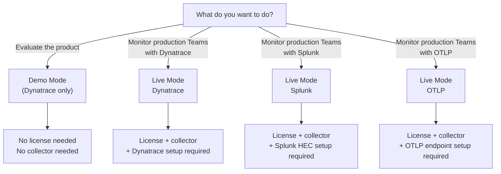

import { Aside } from '@astrojs/starlight/components';

The MS Teams Observability solution supports two operational modes for the Dynatrace application. Splunk and OTLP-compatible backends always operate in live mode.

## Feature Comparison

| Feature | Demo Mode | Live Mode |
|---|---|---|
| Collector required | No | Yes |
| License required | No | Yes |
| Data source | Built-in sample data | Real Microsoft tenant data |
| Data freshness | Static (pre-loaded) | Real-time (every collection interval) |
| Backend setup | Not required | Required (Grail, pipeline, etc.) |
| Dashboards | Fully functional | Fully functional with real data |
| Suitable for | Evaluation, demonstrations, testing | Production operations, incident triage |

## When to Use Each Mode

### Demo Mode

Use demo mode when you want to:

- Evaluate the Dynatrace application before purchasing a license.
- Demonstrate MS Teams Observability to stakeholders.
- Test dashboard configurations and queries without connecting to a real tenant.
- Train team members on the application interface.

No collector installation is needed. The app comes with pre-loaded sample data that covers typical call quality scenarios.

### Live Mode

Use live mode when you are ready for production:

- You have obtained a valid license file.
- The collector is installed and configured on a host with Graph API access.
- Backend infrastructure (Grail bucket, OpenPipeline, routing) is set up.
- You want to monitor real Teams call quality, user activity, and site performance.

In live mode, the Dynatrace application receives real tenant data through the collector and refreshes on each collection cycle.

## Mode Selection Flow

## Switching from Demo to Live

1. Obtain a license file (see <a href={`${import.meta.env.BASE_URL}getting-started/license/`}>License</a>).
2. Deploy the collector (see <a href={`${import.meta.env.BASE_URL}collector/v2/installation/`}>Installation</a>).
3. Configure your backend (see <a href={`${import.meta.env.BASE_URL}backends/`}>Backends</a>).
4. The Dynatrace app automatically switches to live data when it receives real records.

<Aside type="tip">
Demo and live data can coexist. The app shows live data when available and falls back to demo data otherwise.
</Aside>
