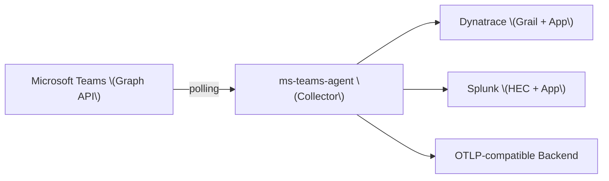

import { Aside, CardGrid, LinkCard } from '@astrojs/starlight/components';

MS Teams Observability is a two-part solution: a **Collector** that pulls Teams telemetry from Microsoft Graph, and **backend integrations** that store and visualize that data in Dynatrace, Splunk, or any OTLP-compatible backend like **Grafana** or **Datadog**.

<CardGrid>
  <LinkCard
    title="Prerequisites"
    description="Everything you need before deploying: Azure app, permissions, network access, and backend access."
    href={`${import.meta.env.BASE_URL}getting-started/prerequisites/`}
  />
  <LinkCard
    title="Install the Collector"
    description="Deploy the collector, validate configuration, and start your first collection cycle."
    href={`${import.meta.env.BASE_URL}collector/v2/installation/`}
  />
  <LinkCard
    title="Connect a Backend"
    description="Choose Dynatrace, Splunk, or OTLP-compatible platforms like Grafana Cloud and Datadog."
    href={`${import.meta.env.BASE_URL}backends/`}
  />
  <LinkCard
    title="License"
    description="Understand demo versus live mode and the license requirements for production use."
    href={`${import.meta.env.BASE_URL}getting-started/license/`}
  />
</CardGrid>

## How It Works

1. The **Collector** authenticates to Microsoft Graph using an Azure app registration and polls Teams telemetry on a configurable interval.
2. It enriches and normalizes the data, then exports it to one or more backends.
3. The **backend application** renders the data in operational dashboards.

## What Data Is Collected

The collector retrieves and exports the following event families:

| Event family | Content |
|---|---|
| `MSTeams_CallRecords_CallMetadata` | Call-level summary: type, health, duration |
| `MSTeams_CallRecords_StreamDetails` | Stream-level quality: RTT, jitter, packet loss |
| `MSTeams_CallRecords_PSTN` | PSTN telephony calls |
| `MSTeams_CallRecords_DirectRouting` | SIP / Direct Routing calls |
| `MSTeams_CallRecords_AutoAttendant` | Auto attendant usage |
| `MSTeams_CallRecords_CallQueue` | Call queue behavior |
| `MSTeams_ServiceAnnouncement` | Microsoft published incidents and advisories |
| `MSTeams_CollectionHealth` | Collector operational health |

See <a href={`${import.meta.env.BASE_URL}reference/metrics-dictionary/`}>Metrics Dictionary</a> for a full field reference.

## Deployment Modes

The solution supports two modes. See <a href={`${import.meta.env.BASE_URL}concepts/demo-vs-live/`}>Demo vs Live Mode</a> for a detailed comparison.

The **Dynatrace application** supports both modes:

- **Demo mode** — uses built-in sample data. No collector required. Useful for evaluation and demonstration.
- **Live mode** — uses real tenant data collected by the collector. Requires a valid license. See <a href={`${import.meta.env.BASE_URL}getting-started/license/`}>License</a>.

Splunk and OTLP-compatible backends like Grafana Cloud and Datadog always operate in live mode and display data as soon as the collector exports records.

## Supported Backends

| Backend | Application included | Notes |
|---|---|---|
| **Dynatrace** | Yes — Grail + dedicated app | Full-featured integration with dashboards |
| **Splunk** | Yes — Splunk app | HEC-based ingestion with dedicated app |
| **OTLP-compatible backend** | No native app | Use with Grafana Cloud, Datadog, or another OTLP receiver |

<Aside type="note">
Each backend requires its own setup. See <a href={`${import.meta.env.BASE_URL}backends/`}>Backends</a> for integration guides.
</Aside>
