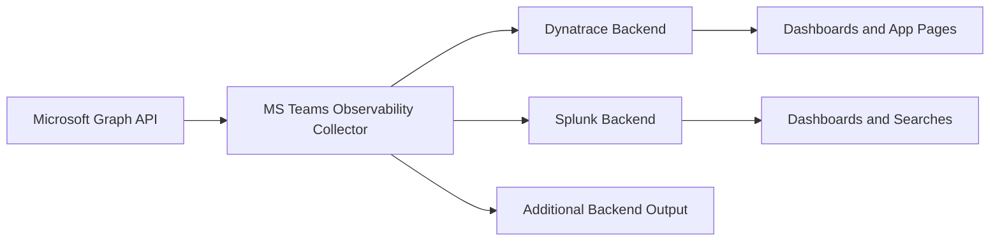

import { CardGrid, LinkCard, Steps, Aside } from '@astrojs/starlight/components';
import dynatraceAppHomePage from '../../assets/images/dynatrace-app-home-page.png';
import dynatraceDashboardSites from '../../assets/images/dynatrace-dashboard-sites.png';
import splunkDashboardOverviewPage from '../../assets/images/splunk-dashboard-overview-page.png';

MS Teams Observability helps you move from raw Microsoft Graph telemetry to operational visibility on call quality, user impact, site/network health, and Microsoft incidents.

## Collector Architecture

This flow shows how a single collector can ingest Microsoft Teams telemetry once and forward it to multiple observability platforms.

## Start in 15 Minutes

<Steps>
1. Check <a href={`${import.meta.env.BASE_URL}getting-started/prerequisites/`}>Prerequisites</a> (Azure app, permissions, network access).
2. Deploy the <a href={`${import.meta.env.BASE_URL}collector/v1/installation/`}>Collector</a> and run one first cycle.
3. Connect your backend in <a href={`${import.meta.env.BASE_URL}backends/`}>Backends</a> (Dynatrace or Splunk).
4. Open dashboards and validate live data.
</Steps>

<Aside type="tip">
If you are setting up for the first time, use this order without skipping steps. Most setup issues come from missing prerequisites or incomplete backend wiring.
</Aside>

## Visual Overview

<figure>
  
  <figcaption>Dynatrace: extension configuration and setup context.</figcaption>
</figure>

<figure>
  
  <figcaption>Dynatrace: sites dashboard example.</figcaption>
</figure>

<figure>
  
  <figcaption>Splunk: overview dashboard example.</figcaption>
</figure>

## Choose Your Backend

<CardGrid>
  <LinkCard
    title="Dynatrace"
    description="Full integration with Grail, OpenPipeline, and a dedicated application for operations and troubleshooting."
    href={`${import.meta.env.BASE_URL}backends/dynatrace/`}
  />
  <LinkCard
    title="Splunk"
    description="HEC-based ingestion with Splunk dashboards for overview, call details, site quality, and NPA."
    href={`${import.meta.env.BASE_URL}backends/splunk/`}
  />
</CardGrid>

## What You Can Monitor

<CardGrid>
  <LinkCard
    title="Call Quality"
    description="Detect degradation trends, isolate poor calls, and inspect stream-level metrics."
    href={`${import.meta.env.BASE_URL}backends/dynatrace/app/calls/`}
  />
  <LinkCard
    title="Users Impact"
    description="Identify who is impacted, how often, and in which device/network context."
    href={`${import.meta.env.BASE_URL}backends/dynatrace/app/users/`}
  />
  <LinkCard
    title="Sites & Networks"
    description="Track quality by location/subnet, NPA status, and network indicators."
    href={`${import.meta.env.BASE_URL}backends/dynatrace/app/sites/`}
  />
  <LinkCard
    title="Microsoft Issues"
    description="Correlate tenant degradation with active and resolved Microsoft incidents."
    href={`${import.meta.env.BASE_URL}backends/dynatrace/app/issues/`}
  />
</CardGrid>

## Documentation by Task

<CardGrid>
  <LinkCard
    title="First Deployment"
    description="Product overview, prerequisites, collector install, and backend connection."
    href={`${import.meta.env.BASE_URL}getting-started/`}
  />
  <LinkCard
    title="Collector Operations"
    description="YAML configuration, CLI, service mode, and extension deployment."
    href={`${import.meta.env.BASE_URL}collector/`}
  />
  <LinkCard
    title="Dynatrace Operations"
    description="Platform setup, app installation, dashboards, and troubleshooting."
    href={`${import.meta.env.BASE_URL}backends/dynatrace/`}
  />
  <LinkCard
    title="Splunk Operations"
    description="Application installation, dashboard pages, HEC connection, and troubleshooting."
    href={`${import.meta.env.BASE_URL}backends/splunk/`}
  />
</CardGrid>

## Troubleshooting Quick Access

<CardGrid>
  <LinkCard
    title="Collector Troubleshooting"
    description="Investigate collection/authentication/export issues on the agent side."
    href={`${import.meta.env.BASE_URL}collector/troubleshooting/`}
  />
  <LinkCard
    title="Dynatrace Troubleshooting"
    description="Resolve ingestion, app, and dashboard issues in Dynatrace."
    href={`${import.meta.env.BASE_URL}backends/dynatrace/troubleshooting/`}
  />
  <LinkCard
    title="Splunk Troubleshooting"
    description="Resolve HEC/index/dashboard issues in Splunk."
    href={`${import.meta.env.BASE_URL}backends/splunk/troubleshooting/`}
  />
</CardGrid>
