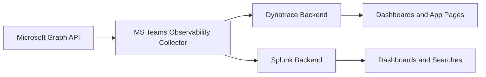

import { CardGrid, LinkCard, Steps, Aside } from '@astrojs/starlight/components';
import dynatraceDashboardSites from '../../assets/images/dynatrace-dashboard-sites.png';

MS Teams Observability is a collector + backend integration solution for Ops and IT teams: it pulls Microsoft Teams telemetry from Microsoft Graph and turns it into actionable dashboards and incident context in Dynatrace or Splunk.

## What You Get

- **Faster Incident Triage**: correlate call degradations with Microsoft advisories and isolate impacted users or sites faster.
- **End-to-End Call Quality Visibility**: track call quality from summary to stream-level metrics across users, devices, and networks.
- **Multi-Backend Ready**: collect once and route telemetry to Dynatrace or Splunk based on your operating model.

## Start in 15 Minutes

<Steps>
1. Check <a href={`${import.meta.env.BASE_URL}getting-started/prerequisites/`}>Prerequisites</a> (Azure app, permissions, and network access).
2. Deploy the <a href={`${import.meta.env.BASE_URL}collector/v1/installation/`}>Collector</a> and run your first collection cycle.
3. Connect your backend in <a href={`${import.meta.env.BASE_URL}backends/`}>Backends</a> (Dynatrace or Splunk).
4. Open dashboards and validate live quality and incident data.
</Steps>

<Aside type="tip">
Follow this order for first-time setup. Most onboarding failures come from missing prerequisites or incomplete backend wiring.
</Aside>

## How It Works

```mermaid
flowchart LR
    A[Microsoft Graph API] --> B[MS Teams Observability Collector]
    B --> C[Dynatrace Backend]
    B --> D[Splunk Backend]
    C --> E[Dashboards and App Pages]
    D --> F[Dashboards and Searches]
```

One collector ingests Teams telemetry once and forwards it to your operational backend.

1. **Authenticate and collect**: the collector uses your Azure app registration to call Microsoft Graph on a schedule.
2. **Normalize and enrich**: records are transformed into consistent event families and enriched with context used for operations and troubleshooting.
3. **Export to one or more backends**: the same collection cycle can send data to Dynatrace, Splunk, or both.
4. **Operate from dashboards and app pages**: teams investigate degraded calls, impacted users/sites, and Microsoft advisories from a single workflow.

Typical telemetry available after ingestion includes:

- Call metadata and stream quality indicators (for example RTT, jitter, and packet loss).
- PSTN / Direct Routing / Auto Attendant / Call Queue data.
- Microsoft service announcements and collector health signals.

## Choose Your Backend

<CardGrid>
  <LinkCard
    title="Dynatrace"
    description="Full integration with Grail, OpenPipeline, and a dedicated app for operations and troubleshooting."
    href={`${import.meta.env.BASE_URL}backends/dynatrace/`}
  />
  <LinkCard
    title="Splunk"
    description="HEC-based ingestion with a dedicated Splunk app and dashboards."
    href={`${import.meta.env.BASE_URL}backends/splunk/`}
  />
</CardGrid>

## Visual Overview

<figure>
  
  <figcaption>Example operational view: site and quality monitoring in Dynatrace.</figcaption>
</figure>

## Documentation by Task

<CardGrid>
  <LinkCard
    title="First Deployment"
    description="Product overview, prerequisites, collector install, and backend connection."
    href={`${import.meta.env.BASE_URL}getting-started/`}
  />
  <LinkCard
    title="Collector Operations"
    description="YAML configuration, CLI, service mode, and extension deployment."
    href={`${import.meta.env.BASE_URL}collector/`}
  />
  <LinkCard
    title="Dynatrace Operations"
    description="Platform setup, app installation, dashboards, and troubleshooting."
    href={`${import.meta.env.BASE_URL}backends/dynatrace/`}
  />
  <LinkCard
    title="Splunk Operations"
    description="Application installation, dashboard pages, HEC connection, and troubleshooting."
    href={`${import.meta.env.BASE_URL}backends/splunk/`}
  />
</CardGrid>

## Troubleshooting Quick Access

<CardGrid>
  <LinkCard
    title="Collector Troubleshooting"
    description="Investigate collection/authentication/export issues on the agent side."
    href={`${import.meta.env.BASE_URL}collector/troubleshooting/`}
  />
  <LinkCard
    title="Dynatrace Troubleshooting"
    description="Resolve ingestion, app, and dashboard issues in Dynatrace."
    href={`${import.meta.env.BASE_URL}backends/dynatrace/troubleshooting/`}
  />
  <LinkCard
    title="Splunk Troubleshooting"
    description="Resolve HEC/index/dashboard issues in Splunk."
    href={`${import.meta.env.BASE_URL}backends/splunk/troubleshooting/`}
  />
</CardGrid>
